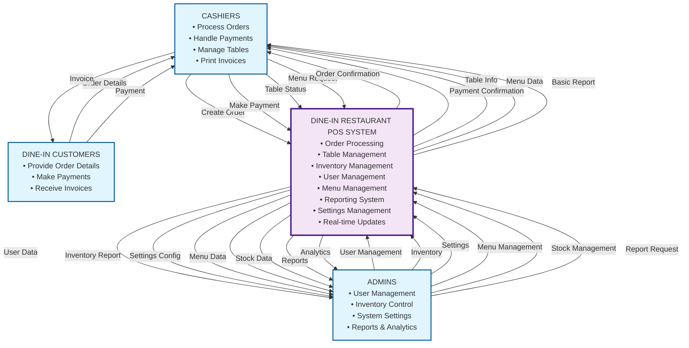

# DINE-IN Restaurant POS System - Context Diagram (Mermaid)

## Level 0 DFD (Context Diagram)

## How to Use This Diagram

### **1. GitHub/GitLab**
- Copy the Mermaid code block above
- Paste it into your markdown file
- It will automatically render

### **2. Online Mermaid Editor**
- Go to [mermaid.live](https://mermaid.live)
- Paste the code
- Export as PNG, SVG, or PDF

### **3. VS Code**
- Install "Mermaid Preview" extension
- Create a .md file with the code
- Right-click and select "Open Preview"

### **4. Notion**
- Create a code block
- Select "Mermaid" as language
- Paste the code

## Diagram Features

### **External Entities (Blue Rectangles):**
- **CASHIERS**: Order processing and customer interaction
- **ADMINS**: System management and reporting
- **DINE-IN CUSTOMERS**: Order placement and payment

### **Central System (Purple Circle):**
- **DINE-IN RESTAURANT POS SYSTEM**: All core functions

### **Data Flows (Labeled Arrows):**
- Clear, specific labels showing exact data movement
- Bidirectional flows where appropriate
- Restaurant-specific terminology

This Mermaid diagram will render as a professional context diagram showing all the relationships and data flows in your dine-in restaurant POS system!

