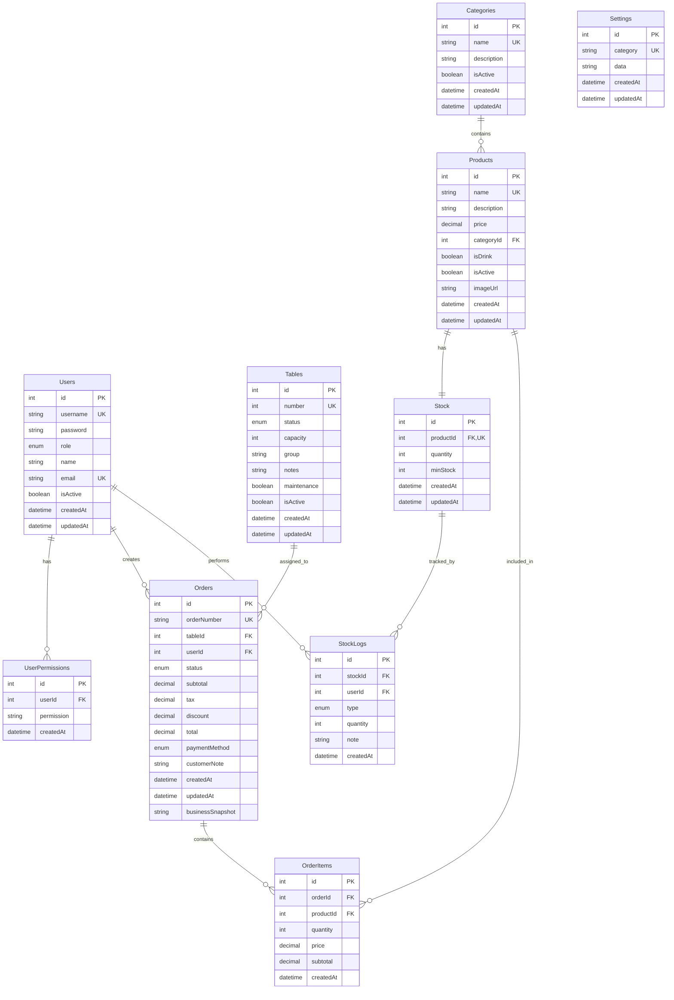

# Restaurant Management System - ER Diagram (Table Style)

## Entity Relationship Diagram



## Database Schema Overview

### Core Tables

| Table | Purpose | Key Relationships |
|-------|---------|-------------------|
| **Users** | Staff management and authentication | Creates Orders, performs StockLogs, has UserPermissions |
| **Tables** | Restaurant table management | Assigned to Orders |
| **Categories** | Product categorization | Contains Products |
| **Products** | Menu items and inventory | Belongs to Category, has Stock, included in OrderItems |
| **Orders** | Customer orders and transactions | Created by User, assigned to Table, contains OrderItems |
| **OrderItems** | Individual items in orders | Belongs to Order, references Product |
| **Stock** | Inventory management | One-to-one with Product, tracked by StockLogs |
| **StockLogs** | Inventory change tracking | Performed by User, tracks Stock changes |
| **UserPermissions** | Granular access control | Belongs to User |
| **Settings** | System configuration | **No relationships** - Standalone configuration storage |

### Relationship Types

- **One-to-One (1:1)**: Products ↔ Stock
- **One-to-Many (1:N)**: All other relationships
- **Many-to-Many (N:M)**: None (properly normalized)

### Foreign Key Relationships

| From Table | To Table | Foreign Key | Purpose |
|------------|----------|-------------|---------|
| UserPermissions | Users | userId | User ownership |
| Products | Categories | categoryId | Product categorization |
| Stock | Products | productId | Inventory tracking |
| Orders | Tables | tableId | Table assignment |
| Orders | Users | userId | Order creator |
| OrderItems | Orders | orderId | Order contents |
| OrderItems | Products | productId | Product reference |
| StockLogs | Stock | stockId | Stock tracking |
| StockLogs | Users | userId | User attribution |

### Enums and Status Values

| Enum | Values | Usage |
|------|--------|-------|
| **UserRole** | ADMIN, CASHIER | User access levels |
| **TableStatus** | AVAILABLE, OCCUPIED, RESERVED | Table availability |
| **OrderStatus** | PENDING, COMPLETED, CANCELLED | Order lifecycle |
| **PaymentMethod** | CASH, CARD | Payment options |
| **StockLogType** | ADD, REMOVE, ADJUST | Inventory operations |

## Business Process Flows

### 1. Order Management Process
```
User → Table → Order → OrderItems → Products
```

### 2. Inventory Management Process
```
User → StockLogs → Stock → Product
```

### 3. Product Management Process
```
Category → Product → Stock
```

### 4. User Activity Tracking
```
User → Orders/StockLogs (audit trail)
```

### 5. Configuration Management
```
Settings (standalone - no relationships)
```

## Data Integrity Rules

### Unique Constraints
- `Users.username` - Unique usernames
- `Users.email` - Unique email addresses
- `Tables.number` - Unique table numbers
- `Categories.name` - Unique category names
- `Products.name` - Unique product names
- `Orders.orderNumber` - Unique order numbers
- `Stock.productId` - One stock record per product
- `Settings.category` - Unique setting categories
- `UserPermissions[userId, permission]` - Unique user permissions

### Indexes for Performance
- `Products.categoryId` - Fast category lookups
- `Orders.tableId` - Fast table order lookups
- `Orders.userId` - Fast user order lookups
- `OrderItems.orderId` - Fast order item lookups
- `OrderItems.productId` - Fast product order item lookups
- `StockLogs.stockId` - Fast stock log lookups
- `StockLogs.userId` - Fast user stock log lookups

### Cascade Operations
- Delete User → Delete UserPermissions
- Delete Order → Delete OrderItems
- Delete Stock → Delete StockLogs
