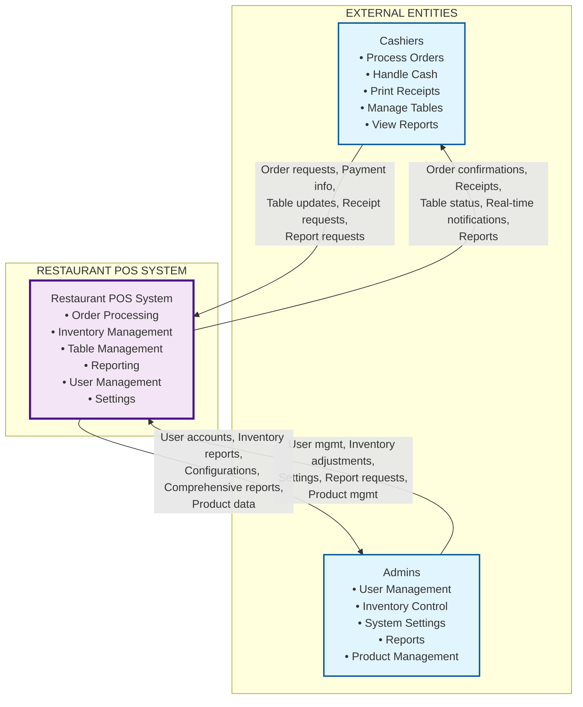
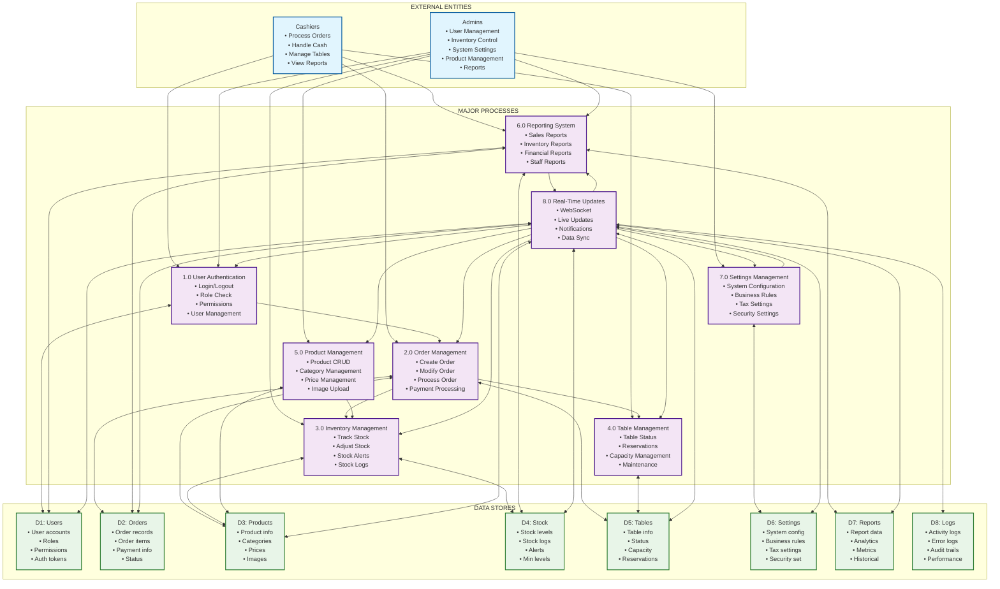
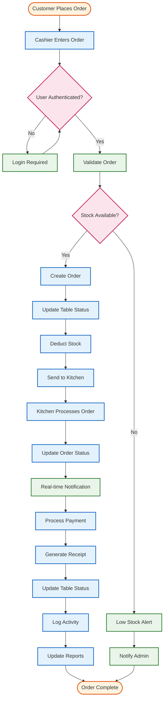
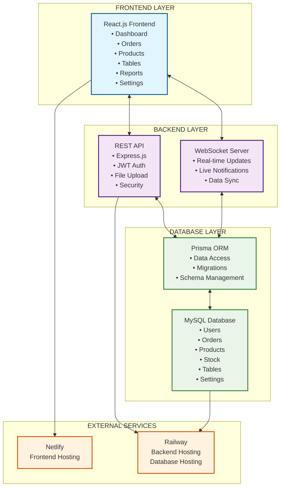

# Restaurant POS System - Mermaid DFD Diagrams

## Overview
This document contains Mermaid code for both Level 0 (Context Diagram) and Level 1 Data Flow Diagrams for the Restaurant POS System. You can render these diagrams in any markdown editor that supports Mermaid (GitHub, GitLab, Notion, etc.).

---

## Level 0 DFD (Context Diagram)

---

## Level 1 DFD (Major Processes)

---

## Detailed Process Flow Diagram

---

## System Architecture Diagram

---

## How to Use These Diagrams

### **1. GitHub/GitLab**
Simply paste the Mermaid code blocks into your markdown files. GitHub and GitLab automatically render Mermaid diagrams.

### **2. Notion**
Use the Mermaid code with Notion's code block feature (select Mermaid as the language).

### **3. Documentation Tools**
- **Docusaurus**: Supports Mermaid out of the box
- **VuePress**: With mermaid plugin
- **GitBook**: Native Mermaid support

### **4. Online Mermaid Editor**
Visit [mermaid.live](https://mermaid.live) to:
- Paste the code and see live preview
- Export as PNG, SVG, or PDF
- Customize colors and styling

### **5. VS Code**
Install the "Mermaid Preview" extension to view diagrams directly in your editor.

---

## Customization Options

You can customize these diagrams by:

1. **Changing Colors**: Modify the `fill` and `stroke` values in the `classDef` sections
2. **Adding More Details**: Include additional processes or data stores
3. **Modifying Layout**: Change `graph TB` (top-bottom) to `graph LR` (left-right) or `graph TD` (top-down)
4. **Adding Icons**: Use emoji or special characters for visual enhancement

These Mermaid diagrams provide a professional, interactive way to visualize your Restaurant POS System's data flow and architecture!
