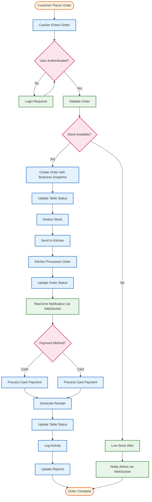

# Restaurant POS System - Mermaid DFD Diagrams

## Overview
This document contains Mermaid code for both Level 0 (Context Diagram) and Level 1 Data Flow Diagrams for the Restaurant POS System. You can render these diagrams in any markdown editor that supports Mermaid (GitHub, GitLab, Notion, etc.).

---

## Level 0 DFD (Context Diagram)

```mermaid
graph TB
    %% External Entities
    subgraph "EXTERNAL ENTITIES"
        CASHIERS[Cashiers<br/>• Process Orders<br/>• Handle Cash/Card<br/>• Print Receipts<br/>• Manage Tables<br/>• View Products<br/>• View Reports]
        ADMINS[Admins<br/>• User Management<br/>• Inventory Control<br/>• System Settings<br/>• Reports<br/>• Product Management<br/>• Stock Management]
        CUSTOMERS[Customers<br/>• Place Orders<br/>• Make Payments<br/>• View Menu<br/>• Check Order Status<br/>• Get Receipts]
        MANAGEMENT[Management<br/>• View Reports<br/>• Monitor Sales<br/>• Track Metrics<br/>• Staff Reports<br/>• Financial Data]
    end

    %% Central System
    subgraph "RESTAURANT POS SYSTEM"
        POS[Restaurant POS System<br/>• Order Processing<br/>• Inventory Management<br/>• Table Management<br/>• Reporting<br/>• User Management<br/>• Settings<br/>• Stock Management<br/>• Product Management]
    end

    %% Data Flows from External Entities to System
    CASHIERS -->|Order requests, Payment info (Cash/Card),<br/>Table updates, Receipt requests,<br/>Product requests, Report requests| POS
    ADMINS -->|User mgmt, Inventory adjustments,<br/>Settings, Report requests,<br/>Product mgmt, Stock mgmt| POS
    CUSTOMERS -->|Order placement, Payment info,<br/>Menu requests, Status inquiries| POS
    MANAGEMENT -->|Report requests, Metrics requests,<br/>Business data, Staff performance| POS

    %% Data Flows from System to External Entities
    POS -->|Order confirmations, Receipts,<br/>Table status, Real-time notifications,<br/>Product info, Basic reports| CASHIERS
    POS -->|User accounts, Inventory reports,<br/>Configurations, Comprehensive reports,<br/>Product data, Stock logs| ADMINS
    POS -->|Receipts, Order confirmations,<br/>Menu info, Order status updates| CUSTOMERS
    POS -->|Financial reports, Sales analytics,<br/>Performance metrics, Business insights,<br/>Staff reports| MANAGEMENT

    %% Styling
    classDef externalEntity fill:#e1f5fe,stroke:#01579b,stroke-width:2px
    classDef system fill:#f3e5f5,stroke:#4a148c,stroke-width:3px
    classDef dataFlow fill:#fff3e0,stroke:#e65100,stroke-width:1px

    class CASHIERS,ADMINS,CUSTOMERS,MANAGEMENT externalEntity
    class POS system
```

---

## Level 1 DFD (Major Processes)

```mermaid
graph TB
    %% External Entities
    subgraph "EXTERNAL ENTITIES"
        CASHIERS[Cashiers<br/>• Process Orders<br/>• Handle Cash/Card<br/>• Manage Tables<br/>• View Products<br/>• View Reports]
        ADMINS[Admins<br/>• User Management<br/>• Inventory Control<br/>• System Settings<br/>• Product Management<br/>• Stock Management<br/>• Reports]
        CUSTOMERS[Customers<br/>• Place Orders<br/>• Make Payments<br/>• View Menu<br/>• Check Status]
        MANAGEMENT[Management<br/>• View Reports<br/>• Monitor Sales<br/>• Track Metrics<br/>• Staff Reports]
    end

    %% Major Processes
    subgraph "MAJOR PROCESSES"
        AUTH[1.0 User Authentication<br/>• Login/Logout<br/>• Role Check (ADMIN/CASHIER)<br/>• Permissions<br/>• User Management<br/>• JWT Tokens]
        
        ORDER[2.0 Order Management<br/>• Create Order<br/>• Modify Order<br/>• Process Order<br/>• Payment Processing (Cash/Card)<br/>• Business Snapshot]
        
        INVENTORY[3.0 Inventory Management<br/>• Track Stock<br/>• Adjust Stock<br/>• Stock Alerts<br/>• Stock Logs<br/>• Min Stock Monitoring]
        
        TABLE[4.0 Table Management<br/>• Table Status<br/>• Reservations<br/>• Capacity Management<br/>• Groups<br/>• Maintenance]
        
        PRODUCT[5.0 Product Management<br/>• Product CRUD<br/>• Category Management<br/>• Price Management<br/>• Image Upload<br/>• Drink Classification]
        
        REPORTING[6.0 Reporting System<br/>• Sales Reports<br/>• Inventory Reports<br/>• Financial Reports<br/>• Staff Reports<br/>• Performance Metrics]
        
        SETTINGS[7.0 Settings Management<br/>• System Configuration<br/>• Business Rules<br/>• Tax Settings<br/>• Security Settings<br/>• Environment Config]
        
        REALTIME[8.0 Real-Time Updates<br/>• WebSocket<br/>• Live Updates<br/>• Notifications<br/>• Data Sync<br/>• Event Broadcasting]
    end

    %% Data Stores
    subgraph "DATA STORES"
        D1[D1: Users<br/>• User accounts<br/>• Roles (ADMIN/CASHIER)<br/>• Permissions<br/>• Auth tokens]
        
        D2[D2: Orders<br/>• Order records<br/>• Order items<br/>• Payment info<br/>• Status<br/>• Business snapshot]
        
        D3[D3: Products<br/>• Product info<br/>• Categories<br/>• Prices<br/>• Images<br/>• Drink classification]
        
        D4[D4: Stock<br/>• Stock levels<br/>• Stock logs<br/>• Alerts<br/>• Min levels<br/>• History]
        
        D5[D5: Tables<br/>• Table info<br/>• Status<br/>• Capacity<br/>• Groups<br/>• Maintenance]
        
        D6[D6: Settings<br/>• System config<br/>• Business rules<br/>• Tax settings<br/>• Security set<br/>• Environment]
        
        D7[D7: Reports<br/>• Report data<br/>• Analytics<br/>• Metrics<br/>• Historical<br/>• Staff data]
        
        D8[D8: Logs<br/>• Activity logs<br/>• Error logs<br/>• Audit trails<br/>• Performance<br/>• WebSocket logs]
    end

    %% External Entity to Process Flows
    CASHIERS --> ORDER
    CASHIERS --> TABLE
    CASHIERS --> AUTH
    CASHIERS --> REPORTING
    CASHIERS --> PRODUCT
    
    ADMINS --> AUTH
    ADMINS --> INVENTORY
    ADMINS --> SETTINGS
    ADMINS --> REPORTING
    ADMINS --> PRODUCT
    ADMINS --> TABLE

    CUSTOMERS --> ORDER
    CUSTOMERS --> PRODUCT

    MANAGEMENT --> REPORTING

    %% Process to Data Store Flows
    AUTH <--> D1
    AUTH <--> D8
    ORDER <--> D2
    ORDER <--> D3
    ORDER <--> D5
    ORDER <--> D8
    INVENTORY <--> D4
    INVENTORY <--> D3
    INVENTORY <--> D8
    TABLE <--> D5
    TABLE <--> D8
    PRODUCT <--> D3
    PRODUCT <--> D8
    REPORTING <--> D7
    REPORTING <--> D2
    REPORTING <--> D4
    REPORTING <--> D1
    REPORTING <--> D8
    SETTINGS <--> D6
    SETTINGS <--> D8
    REALTIME <--> D1
    REALTIME <--> D2
    REALTIME <--> D3
    REALTIME <--> D4
    REALTIME <--> D5
    REALTIME <--> D6
    REALTIME <--> D7
    REALTIME <--> D8

    %% Inter-Process Flows
    AUTH --> ORDER
    ORDER --> INVENTORY
    ORDER --> TABLE
    PRODUCT --> INVENTORY
    REPORTING --> REALTIME
    SETTINGS --> REALTIME
    REALTIME --> AUTH
    REALTIME --> ORDER
    REALTIME --> INVENTORY
    REALTIME --> TABLE
    REALTIME --> PRODUCT
    REALTIME --> REPORTING
    REALTIME --> SETTINGS

    %% Styling
    classDef externalEntity fill:#e1f5fe,stroke:#01579b,stroke-width:2px
    classDef process fill:#f3e5f5,stroke:#4a148c,stroke-width:2px
    classDef dataStore fill:#e8f5e8,stroke:#2e7d32,stroke-width:2px

    class CASHIERS,ADMINS,CUSTOMERS,MANAGEMENT externalEntity
    class AUTH,ORDER,INVENTORY,TABLE,PRODUCT,REPORTING,SETTINGS,REALTIME process
    class D1,D2,D3,D4,D5,D6,D7,D8 dataStore
```

---

## Detailed Process Flow Diagram



---

## System Architecture Diagram

```mermaid
graph TB
    %% Frontend Layer
    subgraph "FRONTEND LAYER"
        REACT[React.js Frontend<br/>• Dashboard<br/>• Orders<br/>• Products<br/>• Tables<br/>• Reports<br/>• Settings<br/>• Stock<br/>• Users<br/>• Categories]
    end
    
    %% Backend Layer
    subgraph "BACKEND LAYER"
        API[REST API<br/>• Express.js<br/>• JWT Auth<br/>• File Upload<br/>• Security<br/>• Role-based Access]
        WS[WebSocket Server<br/>• Real-time Updates<br/>• Live Notifications<br/>• Data Sync<br/>• Event Broadcasting]
    end
    
    %% Database Layer
    subgraph "DATABASE LAYER"
        MYSQL[MySQL Database<br/>• Users (ADMIN/CASHIER)<br/>• Orders with Business Snapshot<br/>• Products with Images<br/>• Stock with Logs<br/>• Tables with Groups<br/>• Settings<br/>• Categories]
        PRISMA[Prisma ORM<br/>• Data Access<br/>• Migrations<br/>• Schema Management<br/>• Type Safety]
    end
    
    %% External Services
    subgraph "EXTERNAL SERVICES"
        NETLIFY[Netlify<br/>Frontend Hosting]
        RAILWAY[Railway<br/>Backend Hosting<br/>Database Hosting]
    end
    
    %% Connections
    REACT <--> API
    REACT <--> WS
    API <--> PRISMA
    WS <--> PRISMA
    PRISMA <--> MYSQL
    REACT --> NETLIFY
    API --> RAILWAY
    MYSQL --> RAILWAY
    
    %% Styling
    classDef frontend fill:#e1f5fe,stroke:#01579b,stroke-width:2px
    classDef backend fill:#f3e5f5,stroke:#4a148c,stroke-width:2px
    classDef database fill:#e8f5e8,stroke:#2e7d32,stroke-width:2px
    classDef external fill:#fff3e0,stroke:#e65100,stroke-width:2px
    
    class REACT frontend
    class API,WS backend
    class MYSQL,PRISMA database
    class NETLIFY,RAILWAY external
```

---

## Database Schema Diagram

```mermaid
erDiagram
    USERS {
        int id PK
        string username UK
        string password
        enum role "ADMIN|CASHIER"
        string name
        string email UK
        boolean isActive
        datetime createdAt
        datetime updatedAt
    }
    
    USER_PERMISSIONS {
        int id PK
        int userId FK
        string permission
        datetime createdAt
    }
    
    TABLES {
        int id PK
        int number UK
        enum status "AVAILABLE|OCCUPIED|RESERVED"
        int capacity
        string group
        string notes
        boolean maintenance
        boolean isActive
        datetime createdAt
        datetime updatedAt
    }
    
    CATEGORIES {
        int id PK
        string name UK
        string description
        boolean isActive
        datetime createdAt
        datetime updatedAt
    }
    
    PRODUCTS {
        int id PK
        string name UK
        string description
        decimal price
        int categoryId FK
        boolean isDrink
        boolean isActive
        string imageUrl
        datetime createdAt
        datetime updatedAt
    }
    
    STOCK {
        int id PK
        int productId FK UK
        int quantity
        int minStock
        datetime createdAt
        datetime updatedAt
    }
    
    ORDERS {
        int id PK
        string orderNumber UK
        int tableId FK
        int userId FK
        enum status "PENDING|COMPLETED|CANCELLED"
        decimal subtotal
        decimal tax
        decimal discount
        decimal total
        enum paymentMethod "CASH|CARD"
        string customerNote
        longtext businessSnapshot
        datetime createdAt
        datetime updatedAt
    }
    
    ORDER_ITEMS {
        int id PK
        int orderId FK
        int productId FK
        int quantity
        decimal price
        decimal subtotal
        datetime createdAt
    }
    
    STOCK_LOGS {
        int id PK
        int stockId FK
        int userId FK
        enum type "ADD|REMOVE|ADJUST"
        int quantity
        string note
        datetime createdAt
    }
    
    SETTINGS {
        int id PK
        string category UK
        longtext data
        datetime createdAt
        datetime updatedAt
    }
    
    USERS ||--o{ USER_PERMISSIONS : "has"
    USERS ||--o{ ORDERS : "creates"
    USERS ||--o{ STOCK_LOGS : "performs"
    TABLES ||--o{ ORDERS : "has"
    CATEGORIES ||--o{ PRODUCTS : "contains"
    PRODUCTS ||--o{ ORDER_ITEMS : "included_in"
    PRODUCTS ||--o| STOCK : "has"
    ORDERS ||--o{ ORDER_ITEMS : "contains"
    STOCK ||--o{ STOCK_LOGS : "tracks"
```

---

## How to Use These Diagrams

### **1. GitHub/GitLab**
Simply paste the Mermaid code blocks into your markdown files. GitHub and GitLab automatically render Mermaid diagrams.

### **2. Notion**
Use the Mermaid code with Notion's code block feature (select Mermaid as the language).

### **3. Documentation Tools**
- **Docusaurus**: Supports Mermaid out of the box
- **VuePress**: With mermaid plugin
- **GitBook**: Native Mermaid support

### **4. Online Mermaid Editor**
Visit [mermaid.live](https://mermaid.live) to:
- Paste the code and see live preview
- Export as PNG, SVG, or PDF
- Customize colors and styling

### **5. VS Code**
Install the "Mermaid Preview" extension to view diagrams directly in your editor.

---

## Customization Options

You can customize these diagrams by:

1. **Changing Colors**: Modify the `fill` and `stroke` values in the `classDef` sections
2. **Adding More Details**: Include additional processes or data stores
3. **Modifying Layout**: Change `graph TB` (top-bottom) to `graph LR` (left-right) or `graph TD` (top-down)
4. **Adding Icons**: Use emoji or special characters for visual enhancement

These Mermaid diagrams provide a professional, interactive way to visualize your Restaurant POS System's data flow and architecture, accurately reflecting the actual implementation!
